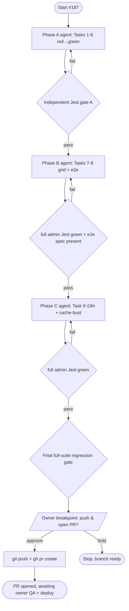

```mermaid
flowchart TD
    Start([Start #187]) --> A_impl[Phase A agent: Tasks 1-6 red→green]
    A_impl --> A_gate{Independent Jest gate A}
    A_gate -- fail --> A_impl
    A_gate -- pass --> B_impl[Phase B agent: Tasks 7-8 grid + e2e]
    B_impl --> B_gate{full admin Jest green + e2e spec present}
    B_gate -- fail --> B_impl
    B_gate -- pass --> C_impl[Phase C agent: Task 9 i18n + cache-bust]
    C_impl --> C_gate{full admin Jest green}
    C_gate -- fail --> C_impl
    C_gate -- pass --> Final{Final full-suite regression gate}
    Final --> BP[/Owner breakpoint: push & open PR?/]
    BP -- approve --> PR[git push + gh pr create]
    BP -- hold --> Hold([Stop, branch ready])
    PR --> Done([PR opened, awaiting owner QA + deploy])
```
