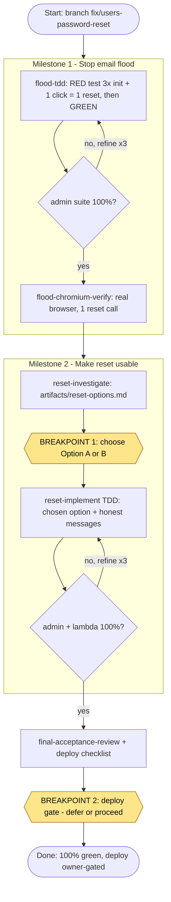

# fix-password-reset — flow

```mermaid
flowchart TD
    Start([Start: branch fix/users-password-reset]) --> M1

    subgraph M1[Milestone 1 - Stop email flood]
        T1[flood-tdd: RED test 3x init + 1 click = 1 reset, then GREEN] --> G1{admin suite 100%?}
        G1 -- no, refine x3 --> T1
        G1 -- yes --> V1[flood-chromium-verify: real browser, 1 reset call]
    end

    V1 --> M2

    subgraph M2[Milestone 2 - Make reset usable]
        I1[reset-investigate: artifacts/reset-options.md] --> BP1{{BREAKPOINT 1: choose Option A or B}}
        BP1 --> T2[reset-implement TDD: chosen option + honest messages]
        T2 --> G2{admin + lambda 100%?}
        G2 -- no, refine x3 --> T2
    end

    G2 -- yes --> R[final-acceptance-review + deploy checklist]
    R --> BP2{{BREAKPOINT 2: deploy gate - defer or proceed}}
    BP2 --> Done([Done: 100% green, deploy owner-gated])

    classDef bp fill:#fde68a,stroke:#b45309,color:#000;
    class BP1,BP2 bp;
```
