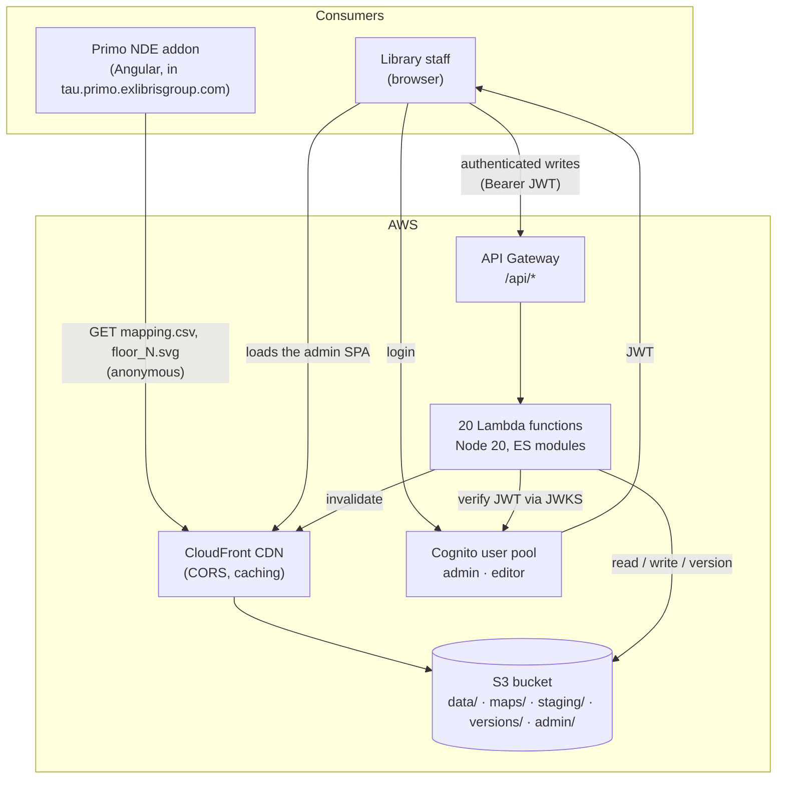
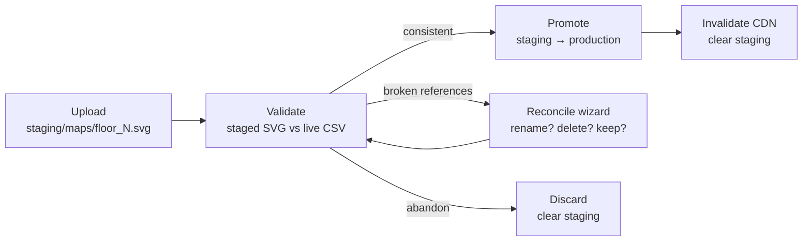

# Primo Maps

**A self-hosted management system for library shelf maps — the data behind the
"where is this book?" map in Primo NDE.**

Built for the Sourasky Central Library at Tel Aviv University, and written to be
portable: if your library shows patrons a floor map with a highlighted shelf,
this repository is a working, tested implementation of everything behind that
highlight — the data model, the editing tools, the consistency rules, and the
serverless infrastructure that publishes it.

Runs entirely on AWS free-tier services. No servers, no build step, no framework.

---

## Table of contents

- [The problem](#the-problem)
- [What Primo consumes](#what-primo-consumes-the-published-contract)
- [Architecture](#architecture)
- [The bundle invariant](#the-bundle-invariant-the-central-idea)
- [Replacing a floor map: the staging flow](#replacing-a-floor-map-the-staging-flow)
- [The admin application](#the-admin-application)
- [Repository layout](#repository-layout)
- [Running it locally](#running-it-locally)
- [Tests](#tests)
- [Deploying](#deploying)
- [Porting this to another library](#porting-this-to-another-library)
- [Operational lessons](#operational-lessons-learned-the-hard-way)
- [How work is done in this repository](#how-work-is-done-in-this-repository)
- [Further documentation](#further-documentation)

---

## The problem

A patron searches Primo, finds a book, and wants to know where it physically is.
The Primo NDE shelf-map addon answers that: it takes the item's call number and
location, and highlights the matching shelf on a floor plan.

For that to work, somebody has to maintain the mapping — *call numbers 300–320 in
the Social Sciences collection live on shelf `ka1_53_a`, on floor 1* — for several
hundred ranges across three floors. Before this project, that mapping lived in a
Google Sheet, and the floor maps were bundled into the Angular addon's source
code. Consequences:

- Updating a map meant a **code deployment**.
- The mapping data sat on an **external service**, with no access control and no
  history.
- Non-technical library staff **could not safely edit** either one.
- When the two drifted apart — a shelf renamed in the SVG, a stale row in the
  sheet — Primo **degraded silently**: search still worked, the highlight just
  never appeared. Nobody noticed for months.

This project replaces that with S3-hosted data, a bilingual admin web app that
librarians operate directly, versioned writes with rollback, and — most
importantly — a **server-enforced consistency rule** that makes the silent
failure mode impossible to introduce.

---

## What Primo consumes: the published contract

Everything the Primo addon needs is two kinds of public, cacheable, static file.
No API, no authentication, no coupling to this system's internals:

| File | Purpose |
|------|---------|
| `data/mapping.csv` | ~420 rows. Which call-number range sits on which shelf. |
| `maps/floor_0.svg`, `floor_1.svg`, `floor_2.svg` | The floor plans, with shelves as addressable elements. |

Live, publicly readable (this is the actual production data):

```
https://d3h8i7y9p8lyw7.cloudfront.net/data/mapping.csv
https://d3h8i7y9p8lyw7.cloudfront.net/maps/floor_1.svg
```

### The CSV schema

14 columns, every user-facing one paired with a Hebrew twin:

| Column | Required | Meaning |
|--------|:--------:|---------|
| `libraryName` / `libraryNameHe` | ✔ | Owning library. |
| `collectionName` / `collectionNameHe` | ✔ | Collection this range belongs to. |
| `rangeStart` / `rangeEnd` | ✔ | Call-number range, inclusive. Both ends must share a prefix. |
| `svgCode` | ✔ | **The link.** Must equal the `id` of a shelf element in the floor's SVG. |
| `floor` | ✔ | `0`, `1`, or `2`. Selects which SVG file `svgCode` is resolved against. |
| `description` / `descriptionHe` | | Free text shown to the patron. |
| `shelfLabel` / `shelfLabelHe` | | Human-readable shelf name ("Information Desk"). |
| `notes` / `notesHe` | | Staff-only notes. |

### The SVG contract

An element in a floor map is a **shelf** if and only if it satisfies both
conditions:

```xml
<rect id="ka1_53_a" data-map-object="shelf" x="..." y="..." />
```

1. it carries `data-map-object="shelf"`, and
2. it has a non-empty `id`.

That rule is the whole schema between the two artifacts. It is implemented once
per runtime — [`lambda/shared/svg-shelves.mjs`](lambda/shared/svg-shelves.mjs)
(server, regex-based) and
[`admin/services/svg-shelves.js`](admin/services/svg-shelves.js) (browser) — and
the two are held in lockstep by parity tests that run both against the same
fixture set. The `data-map-object` marker exists so that decorative geometry
(walls, labels, plants) can never be mistaken for a shelf; a one-shot migration
script, [`scripts/migrate-svg-add-shelf-marker.py`](scripts/migrate-svg-add-shelf-marker.py),
stamped it onto the existing Inkscape exports.

Shelves also carry a `data-shelf-uid` — a random UUID the server stamps onto any
unstamped shelf when a map is promoted to production. It survives a librarian's
round-trip through Inkscape, which is what lets the system tell a **rename**
("this shelf is now called `ka1_53_b`") apart from a **delete plus an unrelated
add**.

---

## Architecture

Fully serverless. Public reads never touch compute; only staff writes do.



**Why serverless:** the write path runs a few thousand times a year at most, from
a team of two or three librarians. The read path is a CDN serving two static
files. Anything with a server to patch would be pure overhead — the entire system
lives inside the AWS free tier.

### S3 layout

```
bucket/
├── data/mapping.csv            # live, public
├── maps/floor_{0,1,2}.svg      # live, public
├── admin/                      # the admin SPA (static files)
├── versions/                   # write history, 20 kept per file
│   ├── data/mapping_<iso-timestamp>_<user>.csv
│   └── maps/floor_N_<iso-timestamp>_<user>.svg
└── staging/                    # in-progress map replacement (7-day S3 lifecycle)
```

Every write goes through a Lambda that first copies the current file into
`versions/`, then writes the new one, then prunes to the newest 20, then
invalidates CloudFront. Version History in the admin UI lists those copies with
timestamp and author, and restores any of them.

### The Lambda surface

20 functions, one job each, grouped by concern:

| Group | Functions |
|-------|-----------|
| Data | `getCsv`, `putCsv` |
| Maps | `listSvg`, `uploadSvg`, `deleteSvg` |
| Staged map replacement | `uploadStagingSvg`, `validateStaging`, `applyReconcileToStaging`, `promoteStaging`, `clearStaging`, `getStagingStatus` |
| Versions | `listVersionsCsv`, `listVersionsSvg`, `getVersion`, `restoreVersion` |
| Users (admin only) | `listUsers`, `createUser`, `updateUser`, `deleteUser`, `resetUserPassword` |

Shared libraries — not deployed as functions — sit alongside:
`auth-middleware.mjs` (Cognito JWT verification against the pool's JWKS, checking
signature, expiry, issuer, `token_use` and audience), `role-auth.mjs` (the
permission matrix), `range-validation.mjs` (CSV parsing and per-editor scope
enforcement), and `shared/` (the rules described below).

### Roles

| Role | read | write | delete | restore versions | manage users |
|------|:----:|:-----:|:------:|:----------------:|:------------:|
| `admin` | ✔ | ✔ | ✔ | ✔ | ✔ |
| `editor` | ✔ | ✔ | | ✔ | |

The role comes from a `custom:role` attribute on the Cognito user (falling back
to `cognito:groups`, defaulting to `viewer`). It is enforced server-side in every
Lambda, and mirrored in the browser only for UI affordances.

An editor can additionally be **scoped** to a subset of the data — by collection,
floor, or call-number range — so a subject librarian edits their own collections
and nothing else. The scope is a JSON filter stored in `custom:allowedRanges` and
evaluated on both sides; the server is the gate.

---

## The bundle invariant (the central idea)

If you take one design idea from this repository, take this one.

`mapping.csv` and the three floor SVGs are two artifacts that must agree, linked
only by a string match (`svgCode` ↔ element `id`). Nothing about that link is
type-checked by anything. And when it breaks, **the consumer does not crash — it
just stops highlighting**. That is the worst possible failure mode: invisible to
the patron, invisible to the operator, and it rots for months.

So the system defines the **bundle** — `mapping.csv` + `floor_0.svg` +
`floor_1.svg` + `floor_2.svg` — as the unit of consistency, and enforces one
rule on every write:

> Every CSV row must declare a floor in `{0, 1, 2}`, and its `svgCode` must
> resolve to a shelf that actually exists in that floor's SVG.

[`lambda/shared/validateBundle.mjs`](lambda/shared/validateBundle.mjs) is the
whole rule, in about 30 lines. A violating save is rejected with **HTTP 422** and
never reaches S3. Violations are logged to CloudWatch under the metric
`bundle.violations.csv_write` whether or not enforcement is on, so the rule could
be observed in production before it was armed.

Three details that make it work in practice rather than in theory:

- **The server is the gate.** The same rule is implemented for the browser
  ([`admin/services/bundle-validator.js`](admin/services/bundle-validator.js)) so
  the UI can warn early, but the client copy is a convenience. Parity tests run
  both implementations against shared fixtures, so they cannot drift.
- **Floors are validated, never coerced.** A blank floor is an `invalid-floor`
  violation. This is not pedantry: `Number('') === 0` once let a floor-0 shelf
  code pass validation while the consumer defaulted the same blank to floor 2 —
  silently placing a shelf on the wrong floor in production.
- **A migration came before the flag.** Existing broken references were cleaned
  up first (via a "broken refs" filter built into the CSV Editor), so switching
  enforcement on didn't start rejecting legitimate day-one edits.

The rule is behind an environment flag, `BUNDLE_INVARIANT_ENABLED`, on the
`putCsv` Lambda. It is `true` in production; setting it to `false` reverts to
log-only mode with no other change — a one-command rollback.

What the invariant deliberately does *not* flag:

- **Orphan shelves** — a shelf in the SVG with no CSV row. That is a normal
  intermediate state (a newly drawn shelf nobody has assigned yet). The Map
  Editor surfaces them as an "Unassigned" group to be filled in.
- **Range overlaps** within a collection. A separate rule handles those, and
  reports them as warnings with a root-cause explanation rather than blocking.

---

## Replacing a floor map: the staging flow

Editing the CSV is frequent and cheap. Replacing an SVG is rare — roughly once a
year, after a physical reorganization — and dangerous: a librarian renames a
shelf in Inkscape, re-uploads, and every CSV row pointing at the old id is
instantly broken. A blocking error would be equally bad, because after a real
reorganization *dozens* of rows legitimately need to move at once.

So map replacement runs through a staging area, and production is not touched
until an explicit promote:



- **Upload** writes to a separate `staging/` prefix and takes a
  first-operator-wins lock. A 7-day S3 lifecycle rule cleans up abandoned
  sessions, so a half-finished reorganization can be resumed next week but never
  lingers forever.
- **Validate** runs the bundle rule against the staged SVGs plus the *current*
  CSV and reports what would break, in plain language.
- **Reconcile** is the interesting part. The system distinguishes a renamed shelf
  from a removed one — primarily by matching `data-shelf-uid` across the two
  versions, falling back to geometry for shelves that carry no uid on either side
  — then asks the operator, in everyday wording, what should happen to each
  affected shelf and the rows pointing at it. Accepted decisions are applied to a
  staged copy of the CSV, not to production.
- **Promote** re-validates, then copies staging over production **atomically** —
  a failure partway through the copy rolls production back rather than leaving
  the bundle half-updated — then invalidates the CDN and clears staging.
- CSV edits are allowed while staging is open; the next validate simply
  re-evaluates against the newer CSV (Git-rebase semantics). No second lock.

Consumer-side atomicity is deliberately *not* solved with a manifest file: the
few seconds during which CloudFront may serve a new SVG with a not-yet-invalidated
CSV is acceptable for a once-a-year operation, and the alternative would have
required changing the Primo addon. Keeping the consumer untouched is a feature.

---

## The admin application

A vanilla-JavaScript single-page app — ES modules loaded directly by the browser,
no bundler, no framework, no build step. Tailwind arrives from a CDN; everything
else is hand-written. It is served as static files from the same bucket as the
data.

The app is **Hebrew-first**: it opens in Hebrew with `dir="rtl"`, and every label,
error, and confirmation exists in both languages. Data fields hold mixed
Hebrew/English content, so bidirectional-text handling is a first-class concern
throughout rather than a coat of paint.

| View | For | What it does |
|------|-----|--------------|
| **CSV Editor** | admin | The full grid. Validate-before-save, per-row duplicate/delete, search, and a "broken refs" filter for cleanup work. |
| **Map Files** | all | Per-floor cards: preview, download, and the staged replace flow above. |
| **Version History** | admin | Every past version with author and timestamp; preview, diff, and restore. |
| **Users** | admin | Cognito user management: create, disable, delete, reset password, assign role and editing scope. |
| **Location Editor** | all | Card-based editing of individual locations, with batch edit and a trash/undo buffer. |
| **Map Editor** | all | Click a shelf on the actual floor plan to see and edit the ranges assigned to it. Shows unassigned shelves, flags range conflicts per floor, and supports reassigning a range to a different shelf by clicking its new home. |
| **Errors** | all | Data-quality dashboard. Groups every validation error and warning by category with plain-language explanations, links straight to the offending row, and exports a styled `.xlsx` report. |

The two map-shaped views are the reason the system replaced a spreadsheet: a
librarian reasons about *shelves and collections*, not about rows 214 through 227.
The CSV stays the source of truth; the map is a lens onto it.

---

## Repository layout

```
admin/                      Admin SPA (vanilla JS, ES modules, no build)
  app.js                    Entry point, view routing, auth headers
  auth-service.js           Cognito hosted-UI OAuth + token lifecycle
  auth-guard.js             Role/scope-based UI visibility
  i18n.js, i18n/{he,en}.json
  components/               One file per view, plus dialogs and shared widgets
    map-editor/             Shelf state, SVG interaction, side panel, orphans
    svg-manager/            Staging panel, reconcile wizard
    errors-dashboard/       Overlap clustering, xlsx export
  services/                 Data model, validation, SVG parsing, logging
  styles/                   Design tokens + app CSS
  __tests__/                82 Jest suites (jsdom)

lambda/                     One .mjs per function + shared libraries
  shared/                   validateBundle, svg-shelves, stamp-shelf-uids, …
  __tests__/                27 Jest suites, incl. cross-runtime parity fixtures

e2e/                        Playwright: fixtures, page objects, 20 spec files
data/mapping.csv            The production mapping data
maps/floor_{0,1,2}.svg      The production floor maps
scripts/                    One-shot migrations
docs/                       Design specs, plans, audits — see docs/INDEX.md
```

---

## Running it locally

There is no build step. Serve the repository over HTTP and open the app:

```bash
npx http-server . -p 8123
# admin app:      http://localhost:8123/admin/
# published data: http://localhost:8123/data/mapping.csv
```

Serving `admin/` at the root also works and is what the Playwright config
expects by default:

```bash
npx http-server admin -p 8080
```

Note that the running app talks to the **production** CloudFront and API Gateway
endpoints, which are hardcoded (see [porting](#porting-this-to-another-library)).
Logging in against the real Cognito pool gives you the real data. For
development against fixtures instead, the E2E suite's auth fixtures and mocked
specs show the pattern.

---

## Tests

Three suites, no CI — they are run locally and their output is pasted into every
pull request.

```bash
# Admin SPA — 978 tests, 82 suites (Jest + jsdom)
cd admin && npm install
NODE_OPTIONS=--experimental-vm-modules npx jest

# Lambda — 420 tests, 27 suites (Jest + aws-sdk-client-mock)
cd lambda && npm install
NODE_OPTIONS=--experimental-vm-modules npx jest

# End-to-end — 20 spec files, ~158 tests (Playwright, Chromium)
npm install && npx playwright install chromium
npx http-server . -p 8123
E2E_BASE_URL=http://localhost:8123 npx playwright test
```

*(Counts verified by running both Jest suites against `main` on 2026-09-06: 978
and 420, all passing.)*

The `--experimental-vm-modules` flag is required: both codebases are native ES
modules. The Playwright suite runs a locale × role matrix (`en`/`he` ×
`admin`/`editor`) because RTL layout and role-gated UI are exactly where this app
breaks.

Two test categories are worth borrowing:

- **Parity tests.** Any rule implemented twice — the SVG shelf parser, the bundle
  validator, the CSV line parser — has both implementations run against a shared
  fixture directory in the same suite. Drift fails the build instead of
  fabricating phantom errors in production.
- **Regression anchors.** Fixes for recurring bugs (stale-cache fetches,
  viewport fit, RTL panel positioning) each carry a named test whose comment says
  what broke and why the fix looks the way it does.

---

## Deploying

Deployment is deliberately boring: static files to S3, a cache invalidation, and
zip uploads for Lambdas.

**Admin SPA** — sync `admin/` to `s3://<bucket>/admin/` excluding tests,
`node_modules`, and coverage; re-upload `index.html` with `Cache-Control:
no-cache` (the entry document must always revalidate so a normal reload picks up
new module versions); then invalidate `/admin/*`.

```bash
aws s3 sync admin/ "s3://<bucket>/admin/" --delete \
  --exclude '__tests__/*' --exclude 'coverage/*' --exclude 'node_modules/*' \
  --exclude 'jest.config.js' --exclude 'package*.json'
aws s3 cp admin/index.html "s3://<bucket>/admin/index.html" \
  --cache-control "no-cache" --content-type "text/html; charset=utf-8"
aws cloudfront create-invalidation --distribution-id <dist-id> --paths "/admin/*"
```

**Lambdas** — zip the function plus its dependencies and
`aws lambda update-function-code`. The six staging functions and their API
Gateway routes have a reproducible, idempotent creation script:
[`deploy-staging-lambdas.sh`](deploy-staging-lambdas.sh) (`--dry-run` prints the
plan; existing resources are skipped with a log line rather than failing).

**Data and maps** — normally written by the app through the Lambdas, which
handle versioning and invalidation. Direct `aws s3 cp` bypasses both; it is for
bootstrapping only.

> **Caution when deploying the SPA:** the sync uses `--delete`. If a feature is
> deployed from a branch but not yet merged, deploying from `main` silently
> reverts it. Deploy from the branch until it lands.

---

## Porting this to another library

The design generalizes; the deployment does not, yet. Nothing is configured by
environment variable or config file on the client — endpoints are `const`
declarations at the top of the modules that use them. That is a real limitation
and the first thing to change if you fork this. Here is exactly what you would
touch.

### 1. Stand up the AWS resources

| Resource | Notes |
|----------|-------|
| S3 bucket | Public `GetObject` on `data/*` and `maps/*` only — see [`bucket-policy.json`](bucket-policy.json). Everything else is reached through CloudFront or Lambda. |
| CloudFront distribution | Origin = the bucket. Attach the AWS-managed **CORS-with-Preflight** response headers policy, and allow `GET, HEAD, OPTIONS`. No query-string-keyed behavior is needed: after a promote the app polls the bare URL's `ETag` until the invalidation has propagated, then re-fetches with a `?v=` token to defeat the *browser* cache. |
| Cognito user pool + hosted UI | Custom attributes `custom:role` (`admin` / `editor`) and `custom:allowedRanges` (the editor's scope, as JSON). `cognito:groups` is honoured as a fallback, and an unrecognised user is `viewer`. The app uses the hosted-UI OAuth flow with `openid email profile`. |
| API Gateway REST API | One resource per Lambda under `/api/…`, `AWS_PROXY` integration, plus an `OPTIONS` MOCK method per resource for CORS. |
| IAM role for Lambda | S3 read/write on the bucket, CloudFront `CreateInvalidation`, CloudWatch Logs, and Cognito user-pool admin actions for the user-management functions. |
| S3 lifecycle rule | Expire `staging/*` after 7 days. |

### 2. Change these values

| What | Where |
|------|-------|
| Cognito pool id, app client id, hosted-UI domain, redirect URI | [`admin/auth-config.js`](admin/auth-config.js) — one file. |
| CloudFront URL (`CLOUDFRONT_URL`) | 10 admin modules. `grep -rl d3h8i7y9p8lyw7 admin/` finds them. |
| API Gateway base URL (`API_ENDPOINT`) | 9 admin modules. `grep -rl tt3xt4tr09 admin/` finds them. |
| Bucket name, distribution id | 15 Lambda files, as `const` at the top of each. |
| Cognito pool id / client id (server) | `lambda/auth-middleware.mjs`, via the `COGNITO_USER_POOL_ID` and `COGNITO_CLIENT_ID` environment variables — already externalized. |
| AWS account id, API id, IAM role ARN | [`deploy-staging-lambdas.sh`](deploy-staging-lambdas.sh). |

### 3. Adapt the model to your building

- **Floors are hardcoded to `{0, 1, 2}`** in
  [`admin/services/data-model.js`](admin/services/data-model.js) (`FLOOR_VALUES`)
  and [`lambda/shared/validateBundle.mjs`](lambda/shared/validateBundle.mjs)
  (`VALID_FLOORS`), and the map filenames follow `floor_N.svg`. A library with a
  different number of floors changes those two constants and the file naming; the
  rest of the system is floor-count agnostic.
- **Languages are Hebrew and English**, with Hebrew as the default and RTL as the
  default direction. Translations live in `admin/i18n/{he,en}.json`; the paired
  `…He` CSV columns are part of the data model, so a monolingual library would
  simplify the schema rather than translate the UI.
- **Call numbers are compared as strings with a shared prefix.** If your
  classification scheme needs different ordering semantics, `compareCallNumbers`
  is the function to change — and note that it currently exists in *three* places
  (`admin/utils/range-filter.js`, `admin/services/data-model.js`,
  `lambda/range-validation.mjs`), so change all three together.

### 4. Prepare your SVGs

Export floor plans from Inkscape or Illustrator, then give every shelf a stable
`id` and the `data-map-object="shelf"` attribute —
[`scripts/migrate-svg-add-shelf-marker.py`](scripts/migrate-svg-add-shelf-marker.py)
does this in bulk from an existing mapping file, preserving formatting byte for
byte. Do **not** hand-add `width`/`height` back onto the root `<svg>`: the app
derives a `viewBox` and strips them so the map scales to fit its container.

### 5. Point your consumer at the two URLs

The Primo addon (or whatever consumes this) needs no knowledge of the admin
system. It fetches the CSV and the SVGs from your CDN, matches the patron's call
number against `rangeStart`/`rangeEnd` within the right collection, reads
`svgCode` and `floor`, and highlights the element with that `id`. That is the
entire integration.

---

## Operational lessons (learned the hard way)

Each of these cost a production incident. They are the parts most likely to be
useful to somebody building something similar.

**CORS must have exactly one owner.** S3 and CloudFront both set CORS headers.
S3's is per-origin; CloudFront's managed policy only *adds* headers when the
origin doesn't send its own, and the default cache policy doesn't include `Origin`
in the cache key. Result: CloudFront cached one requester's
`Access-Control-Allow-Origin` and replayed it to everybody, and the shelf map went
invisible in production. The fix was to **delete the S3 bucket CORS entirely** so
CloudFront serves a single cacheable `Access-Control-Allow-Origin: *`. The old
config file is kept, renamed to `cors-config.removed-2026-07-08.json`, so the
command that would re-break it fails loudly.

**Cache-busting needs a discipline, not a habit.** Floor SVG and CSV fetches all
pass `{ cache: 'no-cache' }` — a conditional request, so an unchanged file still
costs nothing, but a changed one is never served stale. Without it, a re-uploaded
map showed the wrong "N unassigned" badge and unclickable shelves, and a saved CSV
came back looking unsaved. Separately, the SPA's ES-module imports carry `?v=N`
tokens; changing a module means bumping that token **everywhere in its import
chain**, or browsers serve a mix of old and new modules. `index.html` is uploaded
with `Cache-Control: no-cache` so a normal reload always sees the current chain.

**Two parsers of the same format will diverge.** A Lambda parsed CSV with
`split(',')` while the browser handled quoted fields properly. Any row containing
a quoted comma shifted columns server-side — which, once bundle enforcement was
on, manifested as hundreds of phantom "shelf not found" errors. Both parsers are
now covered by a shared-fixture parity test.

**Never coerce a missing value.** `Number('') === 0`. A blank floor passed
validation as floor 0 while the consumer defaulted it to floor 2, and a shelf was
silently placed on the wrong floor. Blank is now an explicit error at both ends.

**Roll out enforcement in three steps.** Log violations in production first
(behind a flag, metric only), clean up the existing violations with tooling built
for the purpose, and only then arm the rule. Keep the flag so the rollback is one
command.

---

## How work is done in this repository

Worth reading if the workflow interests you as much as the code:
[`WORKFLOW.md`](WORKFLOW.md) is the constitution for every change here, human or
agent-made.

The repository owner is an **architect who does not read source code**. Control
is exerted entirely at the boundaries: plain-language acceptance criteria going
in, and the running application coming out. That is only sound if the entity
writing the implementation is never the entity that decides whether it is
correct — otherwise "the tests pass" means nothing. Hence a short list of
non-negotiables:

- Never weaken, skip, narrow, or delete a test to make a build pass.
- If a test looks wrong, file a one-line **spec dispute** in the pull request —
  don't edit the test. The owner adjudicates.
- Every behavioural change ships a test observed going red → green in that run,
  named in the PR.
- Assert at stable boundaries — the API contract, visible UI behaviour — never at
  internal call structure.
- Never report tests as passing without having executed them.

Pull requests use [a template](.github/pull_request_template.md) that requires an
explicit acceptance-criterion ↔ test map. A green suite is a welcome signal,
never the reason to merge; the reason to merge is that the owner exercised the
behaviour in the running app.

---

## Further documentation

[`docs/INDEX.md`](docs/INDEX.md) catalogs everything, with a status marker on each
entry (*Current* / *Historical* / *Pinned*). Highlights:

| Document | What |
|----------|------|
| [`docs/03-ARCHITECTURE.md`](docs/03-ARCHITECTURE.md) | Full architecture reference: data flows, security model, versioning, bilingual strategy. |
| [`docs/AWS-INFRASTRUCTURE.md`](docs/AWS-INFRASTRUCTURE.md) | Every AWS resource, CORS configuration, cache management, troubleshooting runbook. |
| [`docs/02-REQUIREMENTS.md`](docs/02-REQUIREMENTS.md) | Functional and non-functional requirements, constraints, out-of-scope. |
| [`docs/superpowers/specs/`](docs/superpowers/specs/) | Design specs, one per feature, dated. The bundle-invariant spec is the one to read. |
| [`docs/superpowers/plans/`](docs/superpowers/plans/) | The implementation plans those specs became. |
| [`docs/audits/`](docs/audits/) | Investigation records for the recurring bugs referenced above. |
| [`CLAUDE.md`](CLAUDE.md) | Working notes for AI agents: invariants, gotchas, deploy commands. |

---

## Status

In production at the Tel Aviv University Sourasky Central Library, serving the
Primo NDE shelf-map addon. Actively maintained; issues and design history are
tracked in the GitHub repository.

## License

[MIT](LICENSE) — use it, fork it, adapt it for your own library.

The floor plans in `maps/` and the mapping data in `data/` describe a specific
building and its collections. They are included so the system can be read and
run end to end; they are of no use anywhere else, and you will replace both with
your own.
